# QuantumBridge PennyLane Full Fusion Architecture v0.1

**Version**: v0.1 (Design)  
**Date**: 2026-06-06  
**Status**: Draft Architecture  
**Owner**: OpenClaw (QuantumBridge 24-hour R&D Chief of Staff)  

---

## 1. Relationship: PennyLane ↔ QuantumBridge

### 1.1 Core Principle

**QuantumBridge is NOT a PennyLane replacement.**  
**QuantumBridge is a unified bridging layer that exposes PennyLane capabilities alongside Qiskit and QOS capabilities.**

Stage 8A status: this document is used as architecture input for planning and
interface hardening only. It does not authorize full PennyLane implementation,
UI implementation, release creation, tag creation, vendoring, or production
parity claims.

```
PennyLane ──[adapter]──► QuantumBridge ──[adapter]──► Qiskit
PennyLane ──[adapter]──► QuantumBridge ──[adapter]──► QOS
PennyLane ──[adapter]──► QuantumBridge ──[schema]──► User Code
```

### 1.2 What QuantumBridge Does for PennyLane

| QuantumBridge Role | Description |
|---|---|
| **Unified Entry Point** | Single import `from quantumbridge import pennylane` instead of `import pennylane` |
| **Unified Registry** | PennyLane functions registered in `quantumbridge.ecosystem.registry` |
| **Unified Schema** | All PennyLane results wrapped in `PennyLaneResult`, `QNodeResult`, etc. |
| **Unified IR** | PennyLane QNode/Tape converted to `QuantumBridgeIR` |
| **Unified Qiskit Bridge** | PennyLane IR → Qiskit Circuit, Qiskit Circuit → PennyLane QNode |
| **Unified QOS Bridge** | PennyLane IR → QOS Job, QOS Result → PennyLane-like result |
| **Unified Provenance** | Every result tagged with `upstream_package="pennylane"`, `upstream_version`, `capability_level` |
| **Unified Warnings** | All scaffold/advisory capabilities clearly labeled |

### 1.3 What QuantumBridge Does NOT Do for PennyLane

| Forbidden Action | Reason |
|---|---|
| ❌ Copy PennyLane source code | Legal/IP violation |
| ❌ Fork PennyLane | Not the goal |
| ❌ Reimplement PennyLane natively | Waste of effort |
| ❌ Claim official endorsement | Trademark violation |
| ❌ Claim full replacement | False advertising |
| ❌ Claim production parity | Not verified |
| ❌ Vendor PennyLane packages | Dependency management issue |

---

## 2. Relationship: PennyLane ↔ Qiskit ↔ QOS

### 2.1 Three-Way Complementarity

```
┌─────────────────────────────────────────────────────────┐
│                    QuantumBridge SDK                      │
│  ┌──────────┐  ┌──────────┐  ┌──────────────────┐     │
│  │  Qiskit  │  │ PennyLane │  │  QOS / QuantumOS │     │
│  │  Core    │  │   Full   │  │   Runtime        │     │
│  └────┬─────┘  └────┬─────┘  └────────┬─────────┘     │
│       │              │                  │               │
│       └──────────────┼──────────────────┘               │
│                      │                                   │
│              ┌──────▼──────┐                            │
│              │  Unified    │                            │
│              │  IR Layer   │                            │
│              │  + Schema   │                            │
│              │  + Registry │                            │
│              └─────────────┘                            │
└─────────────────────────────────────────────────────────┘
```

### 2.2 Capability Mapping

| Capability | Qiskit | PennyLane | QOS |
|---|---|---|---|
| Circuit Builder | ✅ Native | ✅ via QNode | ✅ via IR |
| Simulator | ✅ Aer | ✅ default.qubit | ⚠️ Experimental |
| Hardware Access | ✅ IBM Cloud | ❌ No | ⚠️ QOS Runtime |
| Differentiable | ❌ No | ✅ Yes | ❌ No |
| Auto-diff | ❌ No | ✅ Yes | ❌ No |
| ML Integration | ❌ Limited | ✅ Torch/JAX/TF | ❌ No |
| Template Library | ❌ No | ✅ Yes | ❌ No |
| Chemistry | ✅ Nature | ✅ qchem | ❌ No |
| Optimization | ✅ Optimization | ✅ QAOA | ⚠️ QOS |
| QML | ❌ ML module | ✅ QNN/Kernels | ❌ No |
| Transforms | ✅ PassManager | ✅ Transforms | ⚠️ QOS |

---

## 3. Relationship: PennyLane ↔ QOS / QuantumOS

### 3.1 QOS as PennyLane Backend

**QOS (QuantumOS Service) is a hypothetical runtime that QuantumBridge plans to support.**

PennyLane's device abstraction allows custom backends. QuantumBridge can provide a `QOSDevice` that:

1. Accepts PennyLane QNode / Tape / IR
2. Converts to QOS job format
3. Submits to QOS backend
4. Returns result wrapped in `PennyLaneResult` schema

### 3.2 QOS Compatibility Requirements

| QOS Feature | PennyLane Support | QuantumBridge Role |
|---|---|---|
| Job Submission | Via QOSDevice | Convert IR → QOS job |
| Topology Awareness | Via device.capabilities() | Map to PennyLane device |
| Noise Profile | Via device noise_model | Pass through |
| Shot-based Execution | Native | Pass through |
| Estimator / Sampler | Via device | Map to PennyLane measure() |
| Error Metadata | Via result metadata | Wrap in provenance |
| Scheduler | Via device | Pass through |

### 3.3 Warning: QOS Not Production Ready

⚠️ **All QOS-related capabilities are EXPERIMENTAL.**
- QOS backend may not exist yet
- QOS device API is a scaffold
- No real QOS cloud integration
- No token storage (IBM Cloud or QOS Cloud)
- All QOS calls are offline-only simulations

---

## 4. Full Module Mapping

### 4.1 PennyLane Modules → QuantumBridge Adapters

| PennyLane Module | Adapter File | QuantumBridge Target | Level | Notes |
|---|---|---|---|---|
| `pennylane` (top-level) | `pennylane_full/__init__.py` | Unified entry | 1 | Re-export with warnings |
| `pennylane.operation` | `operations_adapter.py` | Operation schema | 1-2 | Map to QuantumBridge Op |
| `pennylane.observable` | `observables_adapter.py` | Observable schema | 1-2 | Map to Qiskit Observable |
| `pennylane.measurements` | `measurements_adapter.py` | Measurement schema | 1-2 | shots/analytic |
| `pennylane.QNode` | `qnode_adapter.py` | Workflow schema | 1-2 | Full QNode wrapper |
| `pennylane.devices` | `device_adapter.py` | Device registry | 1 | No device implementation |
| `pennylane.tape` | `tape_adapter.py` | IR schema | 1-2 | Tape ↔ IR conversion |
| `pennylane.transforms` | `transforms_adapter.py` | Transform registry | 1-2 | Transform chain |
| `pennylane.gradients` | `gradients_adapter.py` | Gradient registry | 1-2 | Param shift, backprop |
| `pennylane.templates` | `templates_adapter.py` | Template registry | 1 | Layer templates |
| `pennylane.qchem` | `qchem_adapter.py` | Molecule schema | 1-2 | Hamiltonian generation |
| `pennylane.qaoa` | `qaoa_adapter.py` | QAOA adapter | 1-2 | QAOA ansatz |
| `pennylane.qnn` | `qnn_adapter.py` | QNN schema | 1-2 | SamplerQNN, EstimatorQNN |
| `pennylane.kernels` | `kernels_adapter.py` | Kernel schema | 1-2 | Quantum kernel |
| `pennylane.resource` | `resource_adapter.py` | Resource schema | 1 | Complexity tracking |
| `pennylane.qcut` | `qcut_adapter.py` | QCut schema | 1 | Circuit cutting |
| `pennylane.shadows` | `shadows_adapter.py` | Shadow schema | 1 | Classical shadow |
| `pennylane.data` | `data_adapter.py` | Dataset schema | 1 | Data loading |
| `pennylane.math` | `math_adapter.py` | Math utilities | 1 | Multi-framework math |
| `pennylane.io` | `io_adapter.py` | I/O adapter | 1 | Load/save circuits |
| `pennylane.interfaces` | `interface_adapter.py` | Interface registry | 1-2 | NumPy/Torch/JAX/TF |
| `pennylane.plugins` | `plugin_adapter.py` | Plugin registry | 1 | third-party devices |

---

## 5. Data Flow

### 5.1 QNode Execution Flow

```
User Code (PennyLane API)
        │
        ▼
QuantumBridge Unified Entry
  from quantumbridge.compat.pennylane_full import qnode
        │
        ├──► [Level 1] Passthrough: direct pennylane.qnode()
        │            └──► Pro: zero overhead
        │            └──► Con: no schema, no provenance
        │
        └──► [Level 2] Schema Wrapper: QuantumBridgeQNode
                     │
                     ├──► Wrap input circuit/function
                     ├──► Execute via pennylane.qnode()
                     ├──► Capture result
                     ├──► Wrap in QNodeResult schema
                     ├──► Tag provenance (upstream, version, level)
                     ├──► Add warnings (if applicable)
                     └──► Return QuantumBridge Result
```

### 5.2 IR Conversion Flow

```
PennyLane Tape ──[tape_adapter]──► QuantumBridge IR ──[qiskit_bridge]──► Qiskit Circuit
     │                                       │
     │                                       └──► [qos_bridge]──► QOS Job
     │                                       │
     └──► [qnode_adapter]──► QNodeResult ◄──┘
```

### 5.3 Result Flow

```
Upstream Result (PennyLane native)
        │
        ▼
Result Adapter (pennylane_full/result_adapter.py)
        │
        ├──► Extract data (counts, statevector, eigenvalues)
        ├──► Extract metadata (shots, device, version)
        ├──► Build PennyLaneResult schema
        ├──► Add provenance (upstream, adapter, level)
        ├──► Add warnings (scaffold, advisory, experimental)
        └──► Return QuantumBridge Result object
```

---

## 6. IR (Intermediate Representation) Conversion

### 6.1 QuantumBridge IR Definition

```python
@dataclass
class QuantumBridgeIR:
    """Unified intermediate representation for quantum computations."""
    version: str = "0.1"
    ir_type: str  # "circuit" | "qnode" | "tape" | "workflow"
    wires: List[int]
    operations: List[OperationDef]
    parameters: Dict[str, float]
    measurements: List[MeasurementDef]
    metadata: Dict[str, Any]
    source: ProvenanceInfo
    warnings: List[str]
```

### 6.2 PennyLane Tape → IR

```python
# pennylane_full/tape_adapter.py
def tape_to_ir(tape: qml.tape.QuantumScript) -> QuantumBridgeIR:
    """
    Convert PennyLane QuantumScript (Tape) to QuantumBridge IR.
    
    Key conversions:
    - PennyLane wires → IR wires (preserve numbering)
    - PennyLane ops → IR OperationDef
    - PennyLane measurements → IR MeasurementDef
    - Preserve tape metadata (batch, shots)
    """
    operations = []
    for op in tape.operations:
        op_def = OperationDef(
            name=op.name,
            wires=list(op.wires),
            parameters={p.name: p.value for p in op.parameters},
            # Map PennyLane op name to QuantumBridge canonical name
            canonical_name=OP_NAME_MAP.get(op.name, op.name),
        )
        operations.append(op_def)
    
    measurements = []
    for m in tape.measurements:
        meas_def = MeasurementDef(
            obs=m.obs,
            return_type=m.return_type.value,
            shots=m.shots,
        )
        measurements.append(meas_def)
    
    return QuantumBridgeIR(
        ir_type="tape",
        wires=list(tape.wires),
        operations=operations,
        parameters={},
        measurements=measurements,
        metadata={
            "batch_size": tape.batch_size,
            "shots": tape.shots,
        },
        source=ProvenanceInfo(
            upstream_package="pennylane",
            upstream_version=qml.__version__,
            adapter="tape_adapter",
            capability_level=2,
        ),
        warnings=[],
    )
```

### 6.3 IR → PennyLane Tape

```python
def ir_to_tape(ir: QuantumBridgeIR) -> qml.tape.QuantumScript:
    """
    Convert QuantumBridge IR back to PennyLane QuantumScript.
    
    Key conversions:
    - IR wires → PennyLane wires
    - IR OperationDef → PennyLane operation
    - IR MeasurementDef → PennyLane measurement
    """
    operations = []
    for op_def in ir.operations:
        # Map canonical name back to PennyLane op
        pl_name = REVERSE_OP_NAME_MAP.get(op_def.canonical_name, op_def.name)
        op = qml.apply(
            pl_name,
            wires=op_def.wires,
            **op_def.parameters
        )
        operations.append(op)
    
    measurements = []
    for meas_def in ir.measurements:
        m = qml.measure(meas_def.obs, wires=meas_def.obs.wires)
        measurements.append(m)
    
    return qml.tape.QuantumScript(
        operations=operations,
        measurements=measurements,
        shots=ir.metadata.get("shots"),
    )
```

---

## 7. Result Schema

### 7.1 PennyLaneResult Base

```python
@dataclass
class PennyLaneResult(QuantumBridgeResult):
    """Base schema for all PennyLane results."""
    schema_version: str = "0.1"
    ecosystem: str = "pennylane"
    upstream_package: str = "pennylane"
    upstream_version: str
    quantumbridge_version: str = __version__
    capability_level: int  # 0-4
    mode: str  # "passthrough" | "schema" | "native"
    raw_type: str  # "QNode" | "Tape" | "Measurement" | etc.
    data: Dict[str, Any]
    metadata: Dict[str, Any]
    warnings: List[str]
    provenance: ProvenanceInfo
    
    def to_dict(self) -> dict: ...
    def to_json(self) -> str: ...
    @classmethod
    def from_dict(cls, data: dict) -> "PennyLaneResult": ...
    def validate(self) -> bool: ...
```

### 7.2 Specialized Result Types

| Result Type | Extends | Key Fields |
|---|---|---|
| `QNodeResult` | `PennyLaneResult` | `executable`, `function`, `diff_method`, `interface` |
| `MeasurementResult` | `PennyLaneResult` | `measurements`, `shots`, `state`, `counts`, `probs` |
| `GradientResult` | `PennyLaneResult` | `gradients`, `method`, `parameters` |
| `TransformResult` | `PennyLaneResult` | `transforms_applied`, `output_tape` |
| `QChemResult` | `PennyLaneResult` | `hamiltonian`, `molecule`, `basis` |
| `QNNResult` | `PennyLaneResult` | `predictions`, `labels`, `loss`, `accuracy` |
| `DeviceResult` | `PennyLaneResult` | `device_name`, `capabilities`, `shots` |
| `ResourceResult` | `PennyLaneResult` | `gate_count`, `depth`, `num_wires` |
| `ConversionResult` | `PennyLaneResult` | `source_format`, `target_format`, `converted_data` |

---

## 8. Device / Backend / Runtime

### 8.1 PennyLane Device Model

```
PennyLane Device Abstraction
        │
        ├──► Supported Devices
        │     ├──► default.qubit (statevector, shots)
        │     ├──► default.mixed (density matrix)
        │     ├──► lightning.qubit (C++ simulator)
        │     ├──► qiskit.aer (via PennyLane-Qiskit plugin)
        │     └──► Custom devices (third-party)
        │
        └──► Execution Methods
              ├──► batch_execute (batch of circuits)
              ├──► execute (single circuit)
              └──► compute (analytic results)
```

### 8.2 QuantumBridge Device Abstraction

```python
# quantumbridge/compat/pennylane_full/device_adapter.py

class QuantumBridgeDevice(qml.devices.DefaultQubit):
    """
    QuantumBridge wrapper for PennyLane devices.
    
    This is NOT a real device implementation.
    It wraps existing PennyLane devices with QuantumBridge schema.
    """
    name = "QuantumBridge PennyLane Device Wrapper"
    pennylane_device: qml.devices.Device
    
    def __init__(self, device_name: str, *, shots: int = None, **kwargs):
        # Initialize underlying PennyLane device
        self.pennylane_device = qml.device(device_name, shots=shots, **kwargs)
        super().__init__(wires=kwargs.get("wires"))
    
    def execute(self, tape: qml.tape.QuantumScript) -> PennyLaneResult:
        # Execute via underlying device
        raw_result = self.pennylane_device.execute(tape)
        
        # Wrap in PennyLaneResult schema
        return wrap_pennylane_result(
            raw_result,
            metadata={
                "device_name": device_name,
                "shots": shots,
                "tape": tape,
            },
            provenance=ProvenanceInfo(
                upstream_package="pennylane",
                upstream_version=qml.__version__,
                adapter="device_adapter",
                capability_level=2,
            )
        )
```

### 8.3 QOS Backend as Device

```python
# quantumbridge/compat/pennylane_full/qos_bridge.py

class QOSDevice(qml.devices.Device):
    """
    QOS (QuantumOS) backend as PennyLane device.
    
    ⚠️ EXPERIMENTAL: QOS backend does not exist yet.
    This is a scaffold for future implementation.
    """
    name = "QuantumOS Runtime (Experimental)"
    pennylane_device = None  # Not a real PennyLane device
    
    def __init__(self, backend_url: str = None, **kwargs):
        warnings.warn(
            "QOSDevice is EXPERIMENTAL. "
            "QOS backend does not exist yet. "
            "This device only provides schema wrapping.",
            UserWarning,
            stacklevel=2
        )
        self.backend_url = backend_url
        self.capabilities = kwargs
    
    def execute(self, tape: qml.tape.QuantumScript) -> PennyLaneResult:
        """
        Execute via QOS backend.
        
        ⚠️ Currently this is a scaffold - it does NOT make real API calls.
        It only wraps the tape in QuantumBridgeResult schema.
        """
        # Convert tape to IR
        ir = tape_to_ir(tape)
        
        # Convert IR to QOS job format (scaffold)
        qos_job = ir_to_qos_job(ir)
        
        # Wrap in QOSResult (scaffold)
        return QOSResult(
            ir=ir,
            qos_job=qos_job,
            warnings=[
                "QOS backend not implemented",
                "This is a schema-only wrapper",
                "No real QOS API call is made",
            ],
            provenance=ProvenanceInfo(
                upstream_package="pennylane",
                adapter="qos_bridge",
                capability_level=0,
            )
        )
```

---

## 9. QNode / Tape / Circuit

### 9.1 PennyLane Computation Model

```
┌──────────────────────────────────────────┐
│                  QNode                   │
│  Python function + quantum circuit        │
│  differentiable, supports multiple devs  │
└─────────────────┬────────────────────────┘
                  │
         ┌────────┴────────┐
         │                 │
    ┌────▼────┐       ┌────▼────┐
    │  Tape   │       │  Tape   │
    │(QScript)│       │(QScript)│
    └────┬────┘       └────┬────┘
         │                 │
    Operations        Measurements
    (Gates)           (expect, prob, expval)
```

### 9.2 QuantumBridge QNode Wrapper

```python
# quantumbridge/compat/pennylane_full/qnode_adapter.py

def qnode(
    func: Callable = None,
    *,
    device: str = "default.qubit",
    diff_method: str = "best",
    interface: str = "numpy",
    **kwargs
) -> qml.QNode:
    """
    QuantumBridge wrapper for pennylane.qnode.
    
    Usage:
        @qnode(device="default.qubit")
        def circuit(x):
            qml.RX(x, wires=0)
            qml.CNOT(wires=[0, 1])
            return qml.expval(qml.Z(0))
    
    This decorator:
    1. Calls pennylane.qnode() with the same arguments
    2. Wraps the result in QNodeResult schema
    3. Adds provenance tracking
    4. Adds warnings (if applicable)
    """
    warnings.warn(
        "QuantumBridge qnode is a Level 1 passthrough. "
        "It wraps pennylane.qnode with schema tracking. "
        "No native implementation or parity claim.",
        UserWarning,
        stacklevel=2
    )
    
    # Create PennyLane device
    pl_device = qml.device(device, **kwargs)
    
    # Create QNode via PennyLane
    pl_qnode = qml.QNode(func, pl_device, diff_method=diff_method, interface=interface)
    
    # Wrap in QuantumBridge QNode proxy
    return QuantumBridgeQNode(pl_qnode, provenance=current_provenance())
```

### 9.3 Tape ↔ IR ↔ Qiskit Conversion

```python
# Full conversion pipeline

# PennyLane Tape → QuantumBridge IR
ir = tape_to_ir(pennylane_tape)

# QuantumBridge IR → Qiskit Circuit
qiskit_circuit = qiskit_bridge.ir_to_qiskit(ir)

# Qiskit Circuit → QuantumBridge IR
ir_from_qiskit = qiskit_bridge.qiskit_to_ir(qiskit_circuit)

# QuantumBridge IR → PennyLane Tape
pennylane_tape_back = ir_to_tape(ir_from_qiskit)
```

---

## 10. Transform / Compiler

### 10.1 PennyLane Transform System

```python
# PennyLane Transforms
transforms = [
    "compile",           # Compile to device-native gates
    "defer_measurements", # Defer measurements
    "split_non_commuting", # Group non-commuting
    "cancel_inverses",   # Cancel inverse gates
    "merge_rotation",     # Merge rotations
    "adjoint",           # Adjoint of an operation
    "ctrl",              # Controlled version
    "dot_product",        # Tensor network contraction
    "insert",            # Insert operations
    "apply_registered",   # Apply registered transforms
]
```

### 10.2 QuantumBridge Transform Adapter

```python
# quantumbridge/compat/pennylane_full/transforms_adapter.py

class TransformAdapter:
    """
    Adapter for PennyLane transforms.
    
    This maps PennyLane transforms to QuantumBridge transform registry.
    """
    
    TRANSFORM_MAP = {
        "compile": qml.transforms.compile,
        "defer_measurements": qml.transforms.defer_measurements,
        "split_non_commuting": qml.transforms.split_non_commuting,
        "cancel_inverses": qml.transforms.cancel_inverses,
        "merge_rotation": qml.transforms.merge_rotation,
        "adjoint": qml.transforms.adjoint,
        "ctrl": qml.transforms.ctrl,
    }
    
    def apply_transform(self, tape: qml.tape.QuantumScript, transform_name: str) -> qml.tape.QuantumScript:
        transform = self.TRANSFORM_MAP.get(transform_name)
        if transform is None:
            warnings.warn(f"Transform '{transform_name}' not in TRANSFORM_MAP. "
                          f"Available: {list(self.TRANSFORM_MAP.keys())}", UserWarning)
            return tape
        
        # Apply transform
        transformed_tape, fn = transform(tape)
        
        return transformed_tape
```

---

## 11. Gradient / Optimizer

### 11.1 PennyLane Gradient System

```python
# Supported gradient methods
gradient_methods = [
    "parameter-shift",    # Analytic gradient via shift rule
    "backprop",          # Automatic differentiation (requires interface)
    "adjoint-diff",      # Adjoint differentiation
    "finite-diff",       # Numerical finite difference
    "spsa",              # Simultaneous perturbation stochastic approximation
    "device-batch",      # Device-level batch differentiation
]
```

### 11.2 Gradient Adapter

```python
# quantumbridge/compat/pennylane_full/gradients_adapter.py

class GradientAdapter:
    """
    Adapter for PennyLane gradient computation.
    """
    
    GRADIENT_MAP = {
        "parameter-shift": qml.gradients.param_shift,
        "backprop": qml.gradients.backprop,
        "finite-diff": qml.gradients.finite_diff,
        "spsa": qml.gradients.spsa,
        "adjoint": qml.gradients.adjoint_diff,
    }
    
    def compute_gradient(
        self,
        qnode: qml.QNode,
        parameters: ArrayLike,
        method: str = "parameter-shift"
    ) -> np.ndarray:
        """Compute gradient of QNode using specified method."""
        
        grad_fn = self.GRADIENT_MAP.get(method)
        if grad_fn is None:
            warnings.warn(
                f"Gradient method '{method}' not recognized. "
                f"Available: {list(self.GRADIENT_MAP.keys())}",
                UserWarning
            )
            grad_fn = qml.gradients.param_shift
        
        # Compute gradient
        gradients = grad_fn(qnode)(parameters)
        
        return gradients
```

---

## 12. Chemistry / QML / Templates

### 12.1 QChem Module

```python
# PennyLane qchem module
qchem_functions = [
    "molecular_hamiltonian",  # Generate Hamiltonian from molecule
    " hf_state",              # Hartree-Fock state
    " excitations",           # Single/double excitations
    " amplitude_excitation",   # amplitude embedding
    " givens_decomposition",   # Givens rotation decomposition
    " double_excitation",     # Double excitation gate
    " single_excitation",     # Single excitation gate
    " fermionic_to_ qubits",  # Transform fermionic ops to qubit ops
    " jordan_wigner",         # Jordan-Wigner transform
    " bravyi_kitaev",         # Bravyi-Kitaev transform
    " taper",                 # Taper qubits based on symmetries
]
```

### 12.2 QML Module

```python
# PennyLane QML module
qml_modules = {
    "qnn": {
        "EstimatorQNN": qml.qnn.KerasLayer,  # Actually in pennylane-math
        "SamplerQNN": qml.qnn.SamplerQNN,
    },
    "kernels": {
        "QuantumKernel": qml.kernels.QuantumKernel,
        "kernel_matrix": qml.kernels.kernel_matrix,
    },
}
```

### 12.3 Templates Module

```python
# PennyLane templates (layer/circuit templates)
templates = [
    "BasicEntanglerLayers",
    "StronglyEntanglingLayers",
    "AmplitudeEmbedding",
    "AngleEmbedding",
    "BasicEntanglerLayers",
    "ControlledQubitUnitary",
    "DoubleExcitation",
    "DoubleExcitationPlus",
    "ElectronNucleon",
    "GateFabric",
    "GeometryEmbedding",
    "HadamardGrid",
    "HofstadterLayer",
    "Interferometer",
    "IowaEmbedding",
    "LayerTemplate",
    "LocalBasisEmbed",
    "MercatoniEmbedding",
    "MultiLayerTheme",
    "ParticleConservingU1",
    "ParticleConservingU2",
    "PermutationPad",
    "ProcessorTensor",
    "QAOAEmbedding",
    "QFTEmbedding",
    "RandomLayers",
    "SingleExcitation",
    "SingleExcitationPlus",
    "SpinProduct",
    "SubspaceExpval",
    "SuzukiTrotterLayer",
    "Tessellation",
    "TTNEmbedding",
    "TwoLocal",
    "UCCSD",
    "UCCI",
    "VersalDesign",
    "WStateEmbedding",
]
```

---

## 13. Mermaid Architecture Diagram

```mermaid
graph TB
    subgraph "User Layer"
        USER[User Code]
        UI[Future QuantumBridge Studio]
    end
    
    subgraph "QuantumBridge Core"
        REGISTRY[Ecosystem Registry]
        IR[Unified IR Layer]
        SCHEMA[Result Schema]
        WARN[Warning System]
    end
    
    subgraph "PennyLane Full Adapter"
        PL_INIT[pennylane_full/__init__]
        PL_DEP[dependency.py]
        PL_INV[inventory.py]
        PL_OPS[operations_adapter]
        PL_MEAS[measurements_adapter]
        PL_QNODE[qnode_adapter]
        PL_TAPE[tape_adapter]
        PL_DEV[device_adapter]
        PL_TRANS[transforms_adapter]
        PL_GRAD[gradients_adapter]
        PL_TMPL[templates_adapter]
        PL_QCHEM[qchem_adapter]
        PL_QNN[qnn_adapter]
        PL_KERN[kernels_adapter]
        PL_RES[resource_adapter]
        PL_IO[io_adapter]
        PL_INT[interface_adapter]
        PL_RESULT[result_adapter]
        PL_QISKIT[qiskit_bridge]
        PL_QOS[qos_bridge]
        PL_WARN[warnings.py]
    end
    
    subgraph "PennyLane Ecosystem"
        PL_PENNYLANE[PennyLane Core]
        PL_LIGHTNING[lightning.qubit]
        PL_QISKIT_PLUGIN[PennyLane-Qiskit Plugin]
        PL_THIRDPARTY[Third-party Devices]
    end
    
    subgraph "Qiskit Ecosystem"
        PL_QISKIT_CORE[Qiskit Core]
        PL_AER[Qiskit Aer]
        PL_NATURE[Qiskit Nature]
    end
    
    subgraph "QOS Ecosystem"
        PL_QOS[QOS / QuantumOS Runtime]
        PL_QOS_BACKEND[QOS Backend]
    end
    
    USER --> PL_INIT
    UI --> PL_INIT
    
    PL_INIT --> REGISTRY
    PL_INIT --> SCHEMA
    PL_INIT --> WARN
    
    PL_QNODE --> PL_TAPE
    PL_TAPE --> IR
    PL_TAPE --> PL_RESULT
    
    PL_RESULT --> SCHEMA
    PL_RESULT --> WARN
    
    IR --> PL_QISKIT
    IR --> PL_QOS
    
    PL_QISKIT --> PL_QISKIT_CORE
    PL_QISKIT --> PL_AER
    
    PL_QOS --> PL_QOS_BACKEND
    
    PL_DEP --> PL_PENNYLANE
    PL_INV --> PL_PENNYLANE
    
    PL_MEAS --> PL_RESULT
    PL_TRANS --> PL_RESULT
    PL_GRAD --> PL_RESULT
    PL_QCHEM --> PL_RESULT
    PL_QNN --> PL_RESULT
    PL_KERN --> PL_RESULT
    PL_IO --> PL_RESULT
    
    PL_WARN --> WARN
    
    style PL_QOS fill:#ff9999
    style PL_QOS_BACKEND fill:#ff9999
    style PL_WARN fill:#ffff99
```



---

## 14. Wire Ordering: Critical Compatibility Issue

### 14.1 PennyLane vs Qiskit Wire Ordering

⚠️ **CRITICAL**: PennyLane and Qiskit have DIFFERENT default wire ordering.

| Aspect | PennyLane | Qiskit |
|---|---|---|
| Wire Indexing | Left-to-right | Right-to-left (reversed) |
| Tensor Product | `qml.tensor(w0, w1)` | `w0 ⊗ w1` (reversed) |
| Measurement | `qml.expval(qml.Z(0))` | ` ZZ` on qubits[0,1] |
| Entangling | `CNOT(wires=[0,1])` | `cx(0,1)` same | 

### 14.2 Wire Order Adapter

```python
# quantumbridge/compat/pennylane_full/qiskit_bridge.py

class WireOrderAdapter:
    """
    Adapter for wire ordering differences between PennyLane and Qiskit.
    
    ⚠️ CRITICAL: PennyLane and Qiskit have OPPOSITE wire ordering.
    """
    
    def __init__(self, flip_wires: bool = True):
        """
        Args:
            flip_wires: If True, flip wire indices when converting.
                       Set True when converting Qiskit → PennyLane.
        """
        self.flip_wires = flip_wires
    
    def pennylane_to_qiskit_wires(self, pl_wires: List[int]) -> List[int]:
        """PennyLane wires → Qiskit qubits."""
        if self.flip_wires:
            # PennyLane wire 0 = Qiskit qubit (N-1)
            max_wire = max(pl_wires)
            return [max_wire - w for w in pl_wires]
        return pl_wires
    
    def qiskit_to_pennylane_wires(self, qs_qubits: List[int]) -> List[int]:
        """Qiskit qubits → PennyLane wires."""
        if self.flip_wires:
            max_qubit = max(qs_qubits)
            return [max_qubit - q for q in qs_qubits]
        return qs_qubits
```

---

## 15. Unsupported Capabilities

### 15.1 Known Gaps

| Capability | Status | Notes |
|---|---|---|
| PennyLane Dynamic QNode (autograph) | ❌ Not supported | Complex JIT compilation |
| Custom TensorFlow/JAX gradients | ⚠️ Advisory | Interface adapter may not cover all cases |
| PennyLane Lightning GPU | ⚠️ Advisory | Requires CUDA, may fail |
| PennyLane Catalyst (JIT compiler) | ❌ Not planned | Different compilation model |
| PennyLane Lightning Nate | ❌ Not planned | Hardware-specific |
| PennyLane Device plugins (third-party) | ⚠️ Advisory | May have compatibility issues |

### 15.2 Warning Messages

All unsupported/advisory capabilities must emit warnings:

```python
# Example warning for unsupported capability
warnings.warn(
    "PennyLane Catalyst JIT compilation is NOT supported by QuantumBridge. "
    "Use pennylane.qnode() directly for JIT compilation. "
    "QuantumBridge does not provide a Catalyst bridge.",
    UserWarning,
    stacklevel=2
)
```

---

## 16. Version Compatibility

### 16.1 Tested PennyLane Versions

| PennyLane Version | Status | Notes |
|---|---|---|
| 0.30.0 - 0.33.0 | ⚠️ Advisory | Older, limited testing |
| 0.34.0 - 0.38.0 | ✅ Tested | Primary target |
| 0.39.0 - 0.44.0 | ✅ Tested | Current installed: 0.44.1 |

### 16.2 autoray Compatibility

⚠️ **CRITICAL**: PennyLane requires `autoray<0.8` for full compatibility.

```python
# In pyproject.toml
dependencies = [
    "pennylane>=0.34",
    "autoray<0.8",  # Required for PennyLane
]
```

---

## 17. Attribution and Legal

### 17.1 Required Attribution

All PennyLane-related files must include:

```python
# This file is independently implemented for QuantumBridge SDK.
# No source code from PennyLane or Xanadu was copied.
# PennyLane is a product of Xanadu Quantum Technologies Inc.
# Licensed under the Apache License 2.0.
# https://pennylane.ai
```

### 17.2 License Compatibility

| Component | License | Compatible with QuantumBridge? |
|---|---|---|
| PennyLane Core | Apache 2.0 | ✅ Yes |
| PennyLane Plugins | Various | ⚠️ Check per-plugin |
| PennyLane Lightning | Apache 2.0 | ✅ Yes (if installed) |
| autoray | Apache 2.0 | ✅ Yes |

### 17.3 Trademark Policy

❌ **DO NOT** claim:
- "QuantumBridge is PennyLane"
- "Powered by PennyLane" (without attribution)
- "Official PennyLane integration"
- "PennyLane certified"

✅ **ALWAYS include**:
- "Powered by PennyLane via QuantumBridge adapter"
- "QuantumBridge provides a bridge to PennyLane capabilities"
- "PennyLane is a product of Xanadu Quantum Technologies"

---

## 18. Testing Strategy

### 18.1 Test Categories

| Category | File | Scope |
|---|---|---|
| Passthrough | `test_pennylane_passthrough.py` | Direct PennyLane API calls |
| Schema | `test_pennylane_result_schema.py` | Result wrapping |
| Operations | `test_pennylane_operations.py` | Operation conversion |
| QNode | `test_pennylane_qnode.py` | QNode wrapping |
| Tape | `test_pennylane_tape.py` | Tape ↔ IR conversion |
| Transforms | `test_pennylane_transforms.py` | Transform application |
| Gradients | `test_pennylane_gradients.py` | Gradient computation |
| QChem | `test_pennylane_qchem.py` | Chemistry workflow |
| QNN | `test_pennylane_qnn.py` | QML workflow |
| Qiskit Bridge | `test_pennylane_qiskit_bridge.py` | Cross-framework conversion |
| QOS Bridge | `test_pennylane_qos_bridge.py` | QOS scaffold (experimental) |

### 18.2 Test Requirements

1. All tests must be SKIPPED gracefully if PennyLane not installed
2. All tests must use `warnings.warn()` assertions for scaffold features
3. All result tests must verify provenance fields
4. Wire ordering tests must be explicit about conversion direction

---

## 19. Next Steps

1. **P0**: Inventory PennyLane public API (444 functions as of Stage 7.2)
2. **P1**: Implement Level 1 passthrough for core modules
3. **P2**: Implement Level 2 schema adapters for installed modules
4. **P3**: Implement IR bridge (Tape ↔ IR ↔ Qiskit)
5. **P4**: Implement Qiskit bridge (full circuit conversion)
6. **P5**: Implement QOS bridge (experimental scaffold)
7. **P6**: UI readiness (QuantumBridge Studio integration)

---

**Document Version**: v0.1  
**Last Updated**: 2026-06-06  
**Author**: OpenClaw (QuantumBridge 24-hour R&D Chief of Staff)
