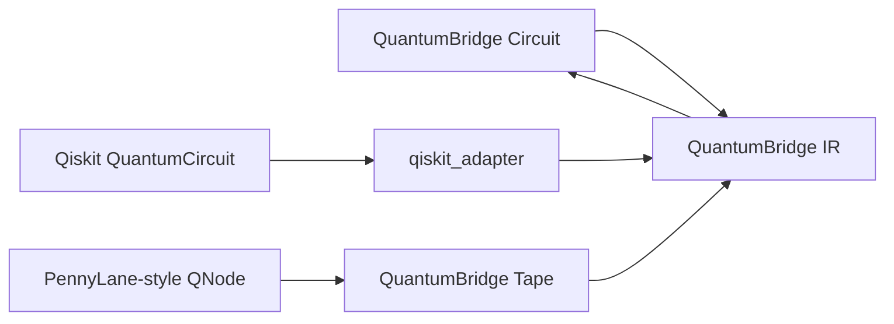
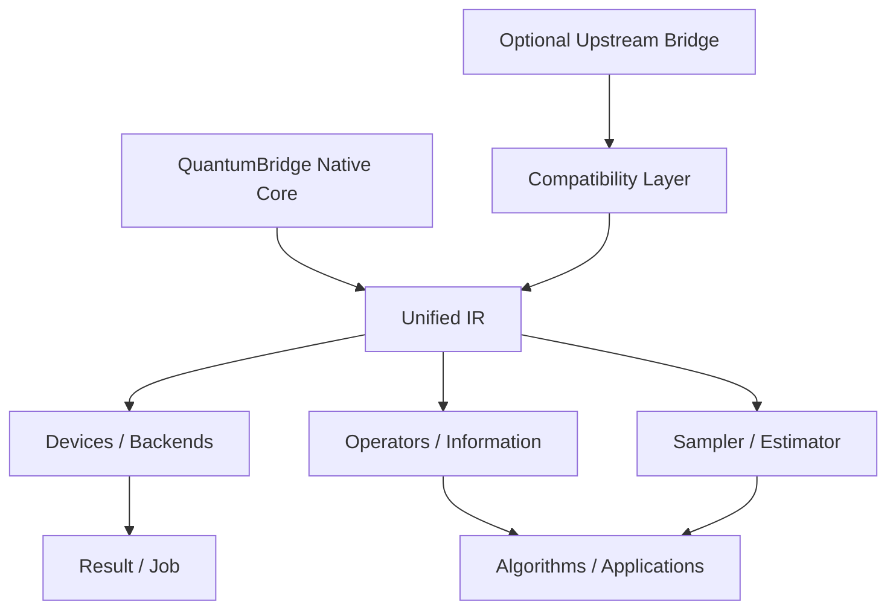
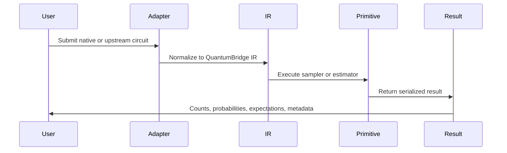

# Qiskit / PennyLane Integration Architecture

Status: Stage 4 draft  
Date: 2026-06-04  

QuantumBridge Stage 4 uses a three-layer architecture: Native Core, Compatibility Layer, and Optional Upstream Bridge. The goal is feature alignment through a unified QuantumBridge IR, not a direct fork or a simple package splice.

## 1. Current MVP architecture

MVP includes:

- Circuit.
- Operation.
- Measurement.
- IR.
- Statevector device.
- Shot sampler.
- Result.
- PauliString / Hamiltonian.
- Parameter-shift.
- VQE / QAOA.
- OpenQASM-style export.

## 2. Qiskit-like mapping

- QuantumCircuit maps to QuantumBridge Circuit and IR.
- Pauli and SparsePauliOp-like data map to QuantumBridge PauliString and SparsePauliOperator.
- Statevector and DensityMatrix map to QuantumBridge information objects.
- Sampler and Estimator map to QuantumBridge primitives.
- Backend/Job/Result map to QuantumBridge providers and results.
- Transpiler/PassManager/CouplingMap/Target map to QuantumBridge compiler abstractions.

## 3. PennyLane-like mapping

- QNode maps to QuantumBridge QNode wrapper.
- Tape maps to QuantumBridge tape-like record and IR.
- Device maps to QuantumBridge Device/Backend.
- Observable and Hamiltonian map to QuantumBridge operators.
- Gradient transforms map to QuantumBridge transforms.
- Templates and embeddings map to QuantumBridge qml templates.

## 4. Adapter modules

- `quantumbridge.compat.qiskit_adapter`
- `quantumbridge.compat.pennylane_adapter`
- `quantumbridge.compat.qasm_adapter`
- `quantumbridge.interfaces.numpy_interface`
- `quantumbridge.interfaces.torch_interface`
- `quantumbridge.interfaces.jax_interface`

## 5. Native implementation modules

- `quantumbridge.core`
- `quantumbridge.ir`
- `quantumbridge.operators`
- `quantumbridge.information`
- `quantumbridge.primitives`
- `quantumbridge.compiler`
- `quantumbridge.providers`
- `quantumbridge.qml`
- `quantumbridge.transforms`

## 6. Upstream dependency modules

Optional dependencies may be used for:

- Qiskit object conversion.
- PennyLane object conversion.
- Qiskit Aer execution later.
- PennyLane plugin device execution later.
- Torch/JAX array bridge.

## 7. Source port candidates

No source port is performed in the current P0 implementation. Future candidates require attribution, ledger updates, and review.

## 8. Temporarily deferred modules

- Pulse.
- Full transpiler.
- Noise simulation.
- Quantum chemistry.
- Tensor-network simulation.
- Full plugin ecosystem.

## 9. Unified IR role

QuantumBridge IR is the common exchange point:

- QuantumBridge Circuit -> IR.
- Qiskit QuantumCircuit -> IR -> QuantumBridge Circuit.
- PennyLane operation recording -> Tape -> IR.
- IR -> Qiskit QuantumCircuit subset.
- IR -> native sampler/estimator.

## 10. Circuit / QNode / Tape / IR relationship

## 11. Device / Backend / Provider relationship

- Device executes QuantumBridge circuits locally.
- Backend exposes a provider-style execution abstraction.
- Provider discovers or creates backends.
- Adapter backends may delegate to upstream objects when optional dependencies exist.

## 12. Sampler / Estimator / Measurement relationship

- Measurement describes requested output.
- Sampler returns sampled counts/probabilities.
- Estimator returns expectation values for circuits and observables.
- Result carries serialization and metadata.

## 13. Gradient / Transform / Optimizer relationship

- Gradient functions compute numeric derivatives.
- Transforms rewrite objectives or circuits.
- Optimizers consume objective and gradient values.
- Algorithms orchestrate circuit construction, estimator calls, and optimizer updates.

## 14. Algorithm / Application layer relationship

VQE, QAOA, finance, optimization, weather, and embodied-intelligence applications sit above primitives and devices.

## 15. Mermaid architecture graph

## 16. Data flow

## 17. Migration risk graph

