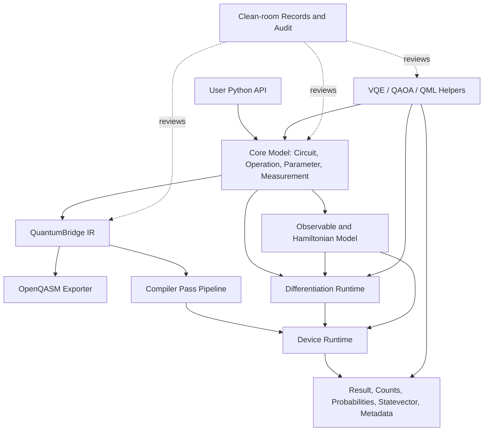

# QuantumBridge SDK Clean-room Functional Specification v0.1

Status: Draft v0.1  
Date: 2026-06-04  
Scope: Functional specification, MVP definition, clean-room controls, behavior test plan, and implementation task breakdown.  

This document is independently authored for QuantumBridge SDK. It is a behavior-level specification and does not contain source code, copied implementation details, copied tests, copied comments, or copied documentation from Qiskit, PennyLane, or related plugin projects.

## 第一部分：Clean-room 执行方案

### 1.1 项目目标

QuantumBridge SDK is a new Python quantum computing SDK designed through a clean-room rewrite process. It should support mainstream quantum computing workflows across two broad areas:

- Gate-based quantum circuit construction, execution, simulation, compilation, and result analysis.
- Differentiable quantum programming, quantum machine learning, hybrid optimization, VQE, and QAOA workflows.

The project aims for functional coverage and clear migration paths, not source compatibility, directory compatibility, test compatibility, or textual compatibility with any existing SDK.

### 1.2 非目标

QuantumBridge SDK v0.1 does not aim to:

- Reproduce any existing project's internal architecture, source layout, implementation strategy, error wording, tests, tutorials, or comments.
- Provide full API drop-in compatibility with any third-party SDK.
- Implement production hardware cloud access in the first MVP.
- Implement all compiler passes, all noise channels, all differentiable interfaces, or large-scale distributed simulation in the first MVP.
- Provide legal clearance by itself. The audit report is an engineering compliance artifact and should be reviewed by qualified counsel before public release or commercial distribution.

### 1.3 Clean-room 约束

The project uses a three-team model:

- Specification Team: reads only public behavior descriptions, public standards, textbooks, papers, and public API references; writes behavior specifications without source-derived implementation details.
- Implementation Team: reads only QuantumBridge specifications and approved public standards/math references; implements original source code from scratch.
- Audit Team: reviews project artifacts for source contamination, overly similar structure, copied text, license risks, trademark risks, and release readiness.

Rules:

- Do not view, download, inspect, or copy Qiskit or PennyLane source code, plugin source code, test code, comments, internal implementation notes, or internal directory conventions.
- Do not copy documentation text. When public behavior is needed, summarize the behavior independently.
- Do not copy examples, fixtures, bug cases, exception messages, or test names.
- Use only common quantum computing concepts, public standards, and independent design language.
- Record design decisions, implementation source basis, and audit outcomes.

### 1.4 许可证合规原则

- Project source files must use the QuantumBridge project license selected by maintainers.
- Third-party runtime dependencies must be tracked with SPDX identifiers where practical.
- Dependencies with restrictive licenses must be reviewed before adoption.
- Public standards and papers may be cited as conceptual sources, not copied as implementation text.
- API names that are generic industry terms may be used. Names that are distinctive to another project require explicit interoperability justification.

### 1.5 团队交接门禁

- Specification Team output must contain behavior, mathematics, inputs, outputs, edge cases, and acceptance scenarios only.
- Implementation Team may not receive source-derived artifacts.
- Audit Team must review release candidates before tags, package publication, public demos, or external distribution.
- Every implementation task must reference a QuantumBridge spec section.
- Every source file must include the required clean-room header once code generation begins.

## 第二部分：QuantumBridge SDK 功能规格说明书

### 2.1 核心用户场景

1. Build a small quantum circuit, simulate its statevector, and inspect probabilities.
2. Build a parameterized circuit and evaluate expectation values over observables.
3. Estimate gradients of expectation values using parameter-shift for gates with known shift rules.
4. Run a shot-based sampler and retrieve counts and empirical probabilities.
5. Export a circuit to OpenQASM-compatible text for interchange.
6. Run VQE for a small Hamiltonian using a statevector simulator.
7. Run QAOA for a small MaxCut instance and compare against a random baseline.
8. Prepare a future hardware execution target through a backend/device abstraction without requiring hardware in v0.1.
9. Inspect basic circuit metrics such as width, depth, operation counts, and two-qubit operation counts.
10. Use independent behavior tests to verify mathematical correctness.

### 2.2 Qiskit 类功能映射表

| Capability area | QuantumBridge behavior target | v0.1 scope |
| --- | --- | --- |
| Circuit builder | Create quantum wires, classical bits, append operations, measure, compose, copy, invert where defined | Included |
| Common gates | X, Y, Z, H, S, T, RX, RY, RZ, Phase, CX, CZ, CY, SWAP, iSWAP, CCX, matrix gate | Core subset included |
| Parameters | Symbolic or named parameters bound to numeric values before simulation | Minimal included |
| Text diagram | Human-readable circuit sketch | Deferred unless simple |
| DAG/IR | Convert circuit into QuantumBridge IR and simple DAG view | IR export included, DAG deferred |
| OpenQASM | Export supported operations; import partial subset later | Export included |
| Compiler | Basis decomposition, layout, routing, cancellation, metric reporting | Interface and simple metrics only |
| Backend/device | Statevector simulation, sampling, density/noise/hardware interfaces | Statevector and sampler included |
| Jobs/results | Job status, result object, counts, probabilities, statevector, metadata | Minimal included |
| Noise | Channels, readout error, calibration metadata | Deferred |

This mapping describes functional areas only. It is not an implementation plan copied from any external project.

### 2.3 PennyLane 类功能映射表

| Capability area | QuantumBridge behavior target | v0.1 scope |
| --- | --- | --- |
| Differentiable program | Python-callable quantum program with parameter inputs and measurement outputs | Minimal QNode-style wrapper included |
| Observables | Pauli observables, tensor products, Hamiltonians, Hermitian matrices | Pauli and Hamiltonian subset included |
| Measurements | expectation, probability, sample, state | expectation, probabilities, samples, state included by device result |
| Gradients | parameter-shift, finite difference, adjoint/backprop future interfaces | parameter-shift included |
| QML layers | embeddings, ansatz templates, QNN wrappers | Simple helper functions deferred or minimal |
| Optimizers | gradient descent, Adam, SPSA, natural gradient, QNG | simple gradient descent and optional SPSA/Adam |
| Algorithms | VQE, QAOA, QNN training loop | simple VQE and QAOA included |
| Interfaces | NumPy, JAX, PyTorch bridges | NumPy included; JAX/Torch minimal bridge deferred |

This mapping describes user-facing behavior categories only.

### 2.4 自研架构图



### 2.5 模块边界

Proposed package boundaries:

- `quantumbridge.core`: public construction model for wires, operations, circuits, parameters, and measurements.
- `quantumbridge.ir`: serializable intermediate representation, OpenQASM export, basic graph conversion.
- `quantumbridge.devices`: execution devices and backend abstractions.
- `quantumbridge.results`: result containers, counts, probabilities, job metadata.
- `quantumbridge.observables`: observables, tensor products, Hamiltonians, expectation evaluation.
- `quantumbridge.diff`: differentiable program wrapper, tapes, parameter binding, gradient methods.
- `quantumbridge.compile`: compiler pass interfaces, metrics, decomposition/routing extension points.
- `quantumbridge.noise`: noise channels, readout models, calibration objects, future simulator integration.
- `quantumbridge.qml`: embeddings, ansatz helpers, QNN integration points.
- `quantumbridge.algorithms`: VQE, QAOA, and quantum natural gradient extension point.
- `tests`: behavior-driven tests authored from math and user scenarios.
- `docs`: specifications, design records, audit reports, and compliance checklists.

### 2.6 数据结构设计

Core data structures should be simple, serializable where practical, and implementation-independent:

- Wire: immutable identifier for a quantum or classical line. It may use integer indices or user labels.
- Parameter: named symbolic value that can be bound to a numeric scalar.
- Operation: immutable description containing operation name, target wires, optional control wires, parameters, matrix provider, and metadata.
- Measurement: immutable description of measurement kind, target wires, classical storage target, and optional observable.
- Circuit: ordered collection of operations and measurements with declared wire counts and metadata.
- Observable: Hermitian operator description with target wires and optional coefficients.
- Hamiltonian: weighted sum of observables.
- IR Program: versioned, serializable representation of registers, operations, measurements, parameters, and optional constraints.
- Device Result: structured output containing state, counts, probabilities, expectation values, metadata, and diagnostics.
- Job: stateful handle for queued or completed execution. v0.1 may execute synchronously while preserving the abstraction.

### 2.7 IR 设计

QuantumBridge IR should be independent, versioned, and explicit:

- Program header: IR version, name, metadata, feature flags.
- Wires: quantum wire list and classical wire list.
- Parameters: names, optional numeric values, optional domain hints.
- Instructions: operation identifier, target wires, control wires, parameters, modifiers, and metadata.
- Measurements: measurement kind, source wires, classical destination, observable reference when applicable.
- Constraints: optional basis set, coupling graph, timing hints, readout map, noise references.
- Results contract: expected output fields for a selected execution mode.

IR requirements:

- Round-trip from `Circuit` to IR without losing supported operation information.
- Export supported v0.1 operations to OpenQASM text.
- Reject unsupported export features with QuantumBridge-authored error messages.
- Preserve symbolic parameters when possible; otherwise require binding before export/execution.

### 2.8 Circuit 语义

- A circuit has an ordered operation sequence.
- Quantum wires are initialized to computational basis state `|0...0>` unless a device explicitly states otherwise.
- Operations act on declared target wires in circuit order.
- Measurement samples computational basis outcomes for selected wires unless another measurement kind is specified.
- Parameterized operations require numeric binding before numeric simulation.
- Circuit composition appends operations and requires compatible wire mapping.
- Circuit inverse reverses invertible operations and replaces each operation with its mathematical inverse. Measurements, reset, delay, and barrier are not generally invertible.
- Circuit copy creates an independent circuit value preserving operations and metadata.
- Barriers are scheduling/compiler boundaries and have no statevector effect.
- Delay is timing metadata and has no v0.1 statevector effect unless a noise/timing model is active.
- Reset maps a target wire to `|0>` and is not unitary; full reset support is deferred in v0.1.

### 2.9 Device / Backend 语义

The device abstraction separates circuit description from execution.

Common device capabilities:

- Validate supported operations, measurements, wire count, parameter bindings, and shot configuration.
- Execute a circuit and produce a `Result`.
- Report properties such as name, version, supported operations, maximum wires, coupling map, and optional noise/calibration metadata.

Statevector device:

- Represents an `n`-wire pure state as a complex vector of length `2^n`.
- Applies unitary operations in circuit order.
- Computes exact probabilities from squared amplitudes.
- Computes expectation values for supported observables.

Shot sampler:

- Samples bitstrings from exact probabilities or from a delegated device distribution.
- Returns counts and empirical probabilities.
- Uses an explicit random seed when supplied.

Density, noise, and hardware devices:

- Defined as future-compatible interfaces in v0.1.
- Must declare unsupported behavior clearly when not implemented.

### 2.10 Measurement 语义

Supported measurement concepts:

- State: return final state representation when supported.
- Probability: return exact or empirical probabilities over selected wires.
- Sample: return shot samples or counts.
- Expectation: return `<psi|O|psi>` for statevector execution or an estimated average for shot execution.
- Variance: future support using `<O^2> - <O>^2`.

Bit ordering must be documented in QuantumBridge terms. v0.1 should choose one convention and apply it consistently across state indexing, counts, probabilities, and OpenQASM export.

### 2.11 Differentiation 语义

The differentiation model evaluates derivatives of scalar-valued quantum programs with respect to numeric parameters.

v0.1 supported method:

- Parameter-shift for supported single-parameter gates whose generator has two distinct eigenvalues and known shift rule.
- For an expectation function `f(theta)`, the basic shift form is `0.5 * (f(theta + pi/2) - f(theta - pi/2))` for supported rotations under the standard Pauli-generator convention.

Future methods:

- Finite difference for fallback and testing.
- Adjoint differentiation for statevector devices.
- Backprop through compatible array frameworks.
- Higher-order derivative interfaces.

Gradient requirements:

- Gradients must be deterministic when the underlying device is exact.
- Shot-based gradients must report sampling configuration and may be stochastic.
- Unsupported operations must fail with QuantumBridge-authored diagnostics.

### 2.12 Compiler Pass 语义

Compiler passes are transformations from one circuit or IR program to another, with validation and metrics.

Pass categories:

- Analysis pass: computes metadata without changing the program.
- Transform pass: returns a modified program.
- Validation pass: verifies constraints such as supported basis and coupling.

Planned passes:

- Basis decomposition.
- Gate cancellation.
- Single-wire rotation merge.
- Layout selection.
- Coupling-aware routing and SWAP insertion.
- Noise-aware layout.
- Commutation-aware optimization.
- Metrics for depth, two-qubit count, and estimated fidelity.

v0.1 includes pass interfaces and basic metrics, not a complete transpiler.

### 2.13 Noise Model 语义

Noise support is a structured future extension in v0.1:

- Quantum channel: trace-preserving completely positive map represented by Kraus operators or named channel parameters.
- Readout error: classical confusion model over measured bit values.
- Relaxation metadata: T1/T2 and gate duration values for future simulation.
- Calibration: timestamped device property snapshot.

v0.1 may define data containers only. Numerical noise simulation is deferred.

### 2.14 API 草案

Illustrative API names use generic quantum computing terminology. They are not copied from any source project and may change during implementation.

```python
from quantumbridge import Circuit
from quantumbridge.devices import StatevectorDevice, ShotSampler
from quantumbridge.observables import PauliZ, Hamiltonian
from quantumbridge.diff import parameter_shift
from quantumbridge.algorithms import run_vqe, run_qaoa

circuit = Circuit(num_qubits=2, num_bits=2)
circuit.h(0)
circuit.cx(0, 1)
circuit.measure(0, 0)
circuit.measure(1, 1)

device = StatevectorDevice()
state_result = device.run(circuit)
probabilities = state_result.probabilities()

sampler = ShotSampler(shots=1000, seed=123)
sample_result = sampler.run(circuit)
counts = sample_result.counts()
```

Parameterized expectation:

```python
from quantumbridge import Circuit, Parameter
from quantumbridge.devices import StatevectorDevice
from quantumbridge.observables import PauliZ

theta = Parameter("theta")
circuit = Circuit(num_qubits=1)
circuit.ry(theta, 0)

device = StatevectorDevice()
value = device.expectation(circuit.bind({theta: 0.25}), PauliZ(0))
```

Gradient:

```python
def objective(angle):
    bound = circuit.bind({theta: angle})
    return device.expectation(bound, PauliZ(0))

grad = parameter_shift(objective, 0.25)
```

VQE:

```python
hamiltonian = Hamiltonian([
    (-1.0, PauliZ(0)),
    (0.25, PauliZ(1)),
])

answer = run_vqe(
    hamiltonian=hamiltonian,
    ansatz=make_ansatz,
    initial_parameters=[0.1, -0.2],
    device=StatevectorDevice(),
    steps=100,
)
```

QAOA:

```python
answer = run_qaoa(
    graph_edges=[(0, 1), (1, 2), (0, 2)],
    depth=1,
    initial_parameters=[0.3, 0.7],
    device=StatevectorDevice(),
    steps=80,
)
```

### 2.15 示例代码约束

- Examples must be newly authored for QuantumBridge.
- Examples must use small, mathematically inspectable circuits.
- Examples must not copy third-party tutorial phrasing, problem wording, fixtures, or variable naming patterns that are distinctive to another project.

## 第三部分：MVP 范围

### 3.1 MVP v0.1 必须实现

1. Circuit creation with declared quantum and classical wires.
2. Common gates: X, Y, Z, H, RX, RY, RZ, Phase, CX, CZ, SWAP, and a minimal custom unitary gate.
3. Parameter binding for rotation angles.
4. Statevector simulation for supported unitary circuits.
5. Shot-based sampling from computational basis probabilities.
6. Expectation value for Pauli observables and simple Hamiltonian sums.
7. Parameter-shift gradient for supported rotation gates.
8. Simple gradient-based VQE over small Hamiltonians.
9. Simple QAOA for small MaxCut graphs.
10. OpenQASM export for supported v0.1 circuits.
11. Behavior tests for math correctness, sampling shape, gradient sanity, and algorithm smoke tests.
12. Clean-room headers in every source file once implementation begins.

### 3.2 MVP v0.1 明确不实现

1. Full hardware provider integration.
2. Full transpiler and routing pipeline.
3. Full QML layer library.
4. Full noise simulation.
5. Distributed or GPU simulation.
6. Full OpenQASM import.
7. Full density matrix simulator.
8. Full JAX or PyTorch autograd integration.

### 3.3 MVP 验收标准

- All v0.1 behavior tests pass locally.
- Public API examples in this document execute without modification after implementation.
- OpenQASM export produces valid text for the supported operation subset.
- Audit checklist has no unresolved high-severity contamination finding.
- Dependency licenses are recorded.

## 第四部分：API 草案

### 4.1 Package entry points

- `quantumbridge.Circuit`
- `quantumbridge.Parameter`
- `quantumbridge.Operation`
- `quantumbridge.Measurement`
- `quantumbridge.devices.StatevectorDevice`
- `quantumbridge.devices.ShotSampler`
- `quantumbridge.observables.PauliX`
- `quantumbridge.observables.PauliY`
- `quantumbridge.observables.PauliZ`
- `quantumbridge.observables.Identity`
- `quantumbridge.observables.Hamiltonian`
- `quantumbridge.diff.parameter_shift`
- `quantumbridge.algorithms.run_vqe`
- `quantumbridge.algorithms.run_qaoa`

### 4.2 Circuit methods

- `Circuit(num_qubits: int, num_bits: int = 0, name: str | None = None)`
- `x(q)`, `y(q)`, `z(q)`, `h(q)`, `s(q)`, `t(q)`
- `rx(theta, q)`, `ry(theta, q)`, `rz(theta, q)`, `phase(theta, q)`
- `cx(control, target)`, `cz(control, target)`, `cy(control, target)`
- `swap(a, b)`, `iswap(a, b)`, `ccx(c0, c1, target)`
- `unitary(matrix, wires, name=None)`
- `measure(q, bit=None)`
- `barrier(*wires)`, `delay(duration, *wires)`, `reset(q)`
- `compose(other, wire_map=None)`
- `inverse()`
- `copy()`
- `bind(mapping)`
- `to_ir()`
- `to_openqasm()`
- `metrics()`

### 4.3 Device methods

- `device.run(circuit, shots=None, parameters=None) -> Result`
- `device.state(circuit) -> complex array`
- `device.probabilities(circuit, wires=None) -> mapping`
- `device.expectation(circuit, observable) -> float`
- `device.validate(circuit) -> ValidationReport`
- `device.properties() -> DeviceProperties`

### 4.4 Result methods

- `statevector()`
- `counts()`
- `probabilities()`
- `expectation_values()`
- `metadata()`
- `to_dict()`
- `to_json()`

### 4.5 Error model

QuantumBridge should define original exception classes with original messages:

- `QuantumBridgeError`
- `CircuitValidationError`
- `ParameterBindingError`
- `UnsupportedOperationError`
- `DeviceExecutionError`
- `MeasurementError`
- `GradientError`
- `SerializationError`

Exception text must be independently written and should reference QuantumBridge concepts rather than third-party wording.

## 第五部分：模块架构

### 5.1 Proposed tree

```text
quantumbridge/
  __init__.py
  core/
    wires.py
    parameters.py
    operations.py
    measurements.py
    circuit.py
    errors.py
  ir/
    program.py
    qasm_export.py
    graph_view.py
  devices/
    base.py
    statevector.py
    sampler.py
    properties.py
  observables/
    pauli.py
    hamiltonian.py
    expectation.py
  diff/
    program.py
    tape.py
    parameter_shift.py
    finite_difference.py
  compile/
    pass_base.py
    metrics.py
    decomposition.py
    routing.py
  noise/
    channels.py
    readout.py
    calibration.py
  qml/
    embeddings.py
    ansatz.py
    models.py
  algorithms/
    optimizers.py
    vqe.py
    qaoa.py
  results/
    result.py
    job.py
    counts.py
tests/
  behavior/
  unit/
  integration/
docs/
  clean_room_spec/
  audit/
  design_records/
```

This tree is an original QuantumBridge structure. It intentionally separates observables from core circuit construction and separates devices from results.

### 5.2 Module ownership

- Core team owns circuit construction semantics and validation.
- Runtime team owns devices, statevector execution, sampling, and result objects.
- Differentiation team owns parameter-shift and future differentiation interfaces.
- Algorithm team owns VQE, QAOA, and optimizer loops.
- Compiler team owns pass interfaces and future transformation pipeline.
- Audit team owns `docs/audit` and release checklist.

### 5.3 Implementation design notes required later

Each module should have a design note before or with implementation:

- Public behavior source: spec section and math/standard source.
- Data ownership: immutable vs mutable objects.
- Validation rules.
- Known limitations.
- Behavior tests covering the module.
- Clean-room confirmation.

## 第六部分：行为测试清单

Tests must be authored from mathematical definitions, public standards, and original scenarios.

### 6.1 Circuit and gate behavior

- `H|0>` produces amplitudes `(1/sqrt(2), 1/sqrt(2))`.
- `X|0>` produces `|1>`.
- `Z|1>` applies a negative phase to `|1>`.
- `RX(0)`, `RY(0)`, and `RZ(0)` behave as identity up to numerical tolerance.
- `RY(theta)` followed by `RY(-theta)` restores the initial state.
- `CX` maps `|10>` to `|11>` under the documented bit-order convention.
- `SWAP` exchanges two wire states.
- Circuit copy can be mutated independently from the original.
- Circuit inverse restores a state for an invertible operation sequence.

### 6.2 Measurement and sampling

- A deterministic basis state samples only its bitstring.
- A Bell state samples mostly `00` and `11` with approximately equal frequency for enough shots.
- Counts sum to the requested shot count.
- Empirical probabilities sum to one within floating point tolerance.
- Measurement on a subset of wires marginalizes the full distribution.

### 6.3 Observable and expectation

- `<0|Z|0> = 1`.
- `<1|Z|1> = -1`.
- `<+|X|+> = 1`.
- `RY(theta)` then expectation of `Z` equals `cos(theta)` within tolerance.
- Hamiltonian expectation equals the weighted sum of term expectations.
- Identity observable expectation equals one for normalized states.

### 6.4 Differentiation

- Parameter-shift derivative of `RY(theta)` with `Z` expectation equals `-sin(theta)`.
- Parameter-shift derivative at `theta = 0` is near zero for `cos(theta)`.
- Parameter-shift derivative at `theta = pi/2` is near `-1`.
- Unsupported parameterized operations produce a QuantumBridge gradient error.
- Exact-device gradients are deterministic.

### 6.5 OpenQASM export

- Export includes declared quantum and classical storage for simple measured circuits.
- Supported gates are serialized with correct target wires under QuantumBridge's documented convention.
- Parameterized numeric gates serialize numeric angles.
- Unbound parameters either serialize symbolically if supported by the selected exporter mode or fail with a QuantumBridge serialization error.
- Unsupported operations fail without partial silent corruption.

### 6.6 VQE

- A one-qubit Hamiltonian `Z` can be minimized near energy `-1`.
- A two-term diagonal Hamiltonian returns energy no lower than its known minimum.
- Callback receives step index, parameters, and energy.
- Checkpoint metadata is serializable.

### 6.7 QAOA

- A two-node MaxCut instance has a best cut value of one.
- A small triangle graph result exceeds a random baseline expectation in a smoke run.
- Cost Hamiltonian construction uses graph edges and documented bit conventions.
- Returned result includes parameters, objective trace, and final expectation.

### 6.8 Clean-room tests

- Source files contain required QuantumBridge clean-room header.
- No files contain prohibited project names except in compliance documents, comparisons, or explicit clean-room notices.
- No copied third-party license text is present unless a dependency requires it and it is recorded.
- Public examples are original and small.

## 第七部分：开发里程碑

### Milestone 0: Governance and specification

- Create specification v0.1.
- Create clean-room audit report.
- Create design record template.
- Select project license.
- Define prohibited-source policy.

### Milestone 1: Core circuit model

- Implement core errors, wires, parameters, operations, measurements, and circuit object.
- Add clean-room headers.
- Add unit tests for construction and validation.

### Milestone 2: Statevector runtime

- Implement matrix definitions from standard quantum gate mathematics.
- Implement statevector application for one- and two-wire gates.
- Add behavior tests for state evolution.

### Milestone 3: Results and sampling

- Implement result object, probabilities, counts, and seeded shot sampling.
- Add Bell-state and deterministic sampling tests.

### Milestone 4: Observables and gradients

- Implement Pauli observables, Hamiltonian sums, expectation evaluation.
- Implement parameter-shift gradient.
- Add expectation and gradient tests.

### Milestone 5: Algorithms

- Implement simple optimizers.
- Implement VQE.
- Implement QAOA for small graphs.
- Add algorithm smoke tests.

### Milestone 6: Interchange and documentation

- Implement OpenQASM export for supported subset.
- Add examples.
- Update audit report.

### Milestone 7: MVP release candidate

- Run full tests.
- Run audit checklist.
- Produce dependency/license inventory.
- Prepare public release notes with legal review recommendation.

## 第八部分：Clean-room 审计表

| Audit item | v0.1 status | Required evidence |
| --- | --- | --- |
| No Qiskit/PennyLane source viewed | Pending team attestation | Contributor declaration |
| No third-party test code copied | Pending review | Test provenance notes |
| No documentation prose copied | Pending review | Documentation scan |
| Original architecture | Drafted | This specification and design records |
| Similar generic API terms justified | Drafted | API term review |
| Distinctive API names avoided | Pending implementation review | Public API inventory |
| License inventory exists | Not started | Dependency list |
| Math sources cited | Pending implementation | Module design notes |
| Trademark risk reviewed | Pending counsel | Release naming review |
| Patent risk reviewed | Pending counsel | External legal review |
| Release approved | Not yet | Final audit sign-off |

## 第九部分：风险提示

### 9.1 Clean-room contamination risk

Risk: an implementer may unintentionally read source, tests, comments, or distinctive examples from prohibited projects.  
Mitigation: contributor attestation, source-access policy, review checklist, and implementation only from QuantumBridge specs.

### 9.2 API similarity risk

Risk: generic quantum SDK APIs can look similar because the domain vocabulary overlaps.  
Mitigation: keep only generic terms, record interoperability reasons, avoid distinctive names and error text.

### 9.3 Documentation similarity risk

Risk: public docs may influence phrasing too closely.  
Mitigation: write behavior in original language, avoid copying tutorials, and run documentation review before release.

### 9.4 Mathematical correctness risk

Risk: independent implementation may contain simulator, bit-order, gradient, or Hamiltonian sign errors.  
Mitigation: behavior tests from first principles, small exact examples, and independent review.

### 9.5 License risk

Risk: future dependencies may introduce incompatible license obligations.  
Mitigation: dependency review before adoption and SPDX-style inventory.

### 9.6 Trademark risk

Risk: marketing or documentation could imply affiliation with existing SDKs.  
Mitigation: avoid brand use except factual compatibility discussion and include no-affiliation language where needed.

### 9.7 Patent risk

Risk: some compilation, optimization, hardware, or algorithmic techniques may be patent-sensitive.  
Mitigation: use public-domain/basic methods for MVP and obtain external legal review before commercial release.

## 第十部分：下一步代码实现任务拆解

### Task group A: Repository setup

- Choose license and package metadata.
- Add `pyproject.toml` with minimal dependencies.
- Add source tree and test tree.
- Add contributor clean-room attestation template.
- Add design record template.

### Task group B: Core model

- Implement `QuantumBridgeError` hierarchy.
- Implement wire validation.
- Implement parameter object and binding map.
- Implement operation records with gate metadata.
- Implement circuit append, copy, compose, inverse, and metrics.
- Add construction and validation tests.

### Task group C: Gate mathematics

- Implement standard matrices for MVP gates from textbook definitions.
- Implement custom matrix validation.
- Implement inverse and power for supported gates.
- Add state evolution tests.

### Task group D: Statevector and sampler

- Implement state initialization and operation application.
- Implement probability extraction with documented bit ordering.
- Implement seeded sampling.
- Implement result containers.
- Add deterministic, Bell, and subset measurement tests.

### Task group E: Observables and gradients

- Implement Pauli observables and Hamiltonian sums.
- Implement expectation evaluation.
- Implement parameter-shift for supported rotations.
- Add gradient tests against analytic formulas.

### Task group F: Algorithms

- Implement gradient descent optimizer.
- Implement VQE loop with callback and trace.
- Implement QAOA cost construction for small MaxCut graphs.
- Add smoke tests with fixed seeds and loose convergence criteria.

### Task group G: OpenQASM export

- Define supported export subset.
- Implement exporter from QuantumBridge IR.
- Add serialization tests for supported and unsupported cases.

### Task group H: Audit and release

- Run clean-room source scan.
- Complete audit report.
- Record dependency license inventory.
- Produce MVP release notes.
- Request external legal review before public release.
