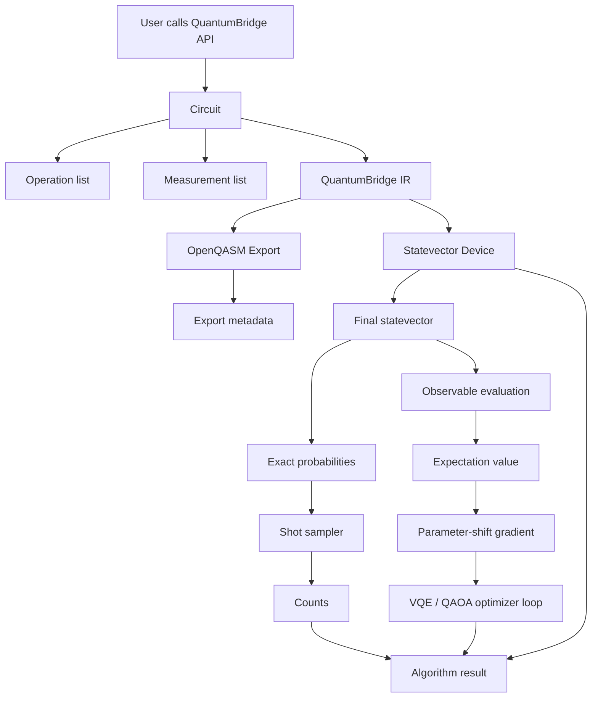
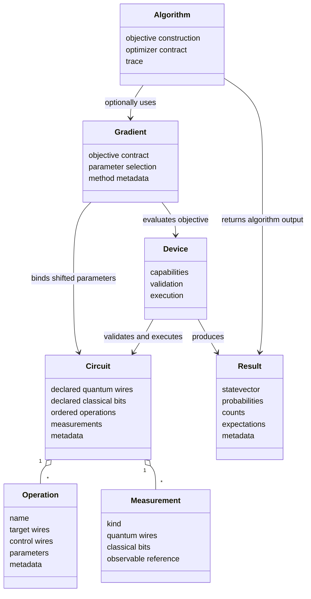

# QuantumBridge SDK MVP Architecture v0.1

Status: Draft  
Date: 2026-06-04  
Source basis: `functional_spec_v0.1.md`, `mvp_scope_v0.1.md`, public quantum computing principles, and independently authored QuantumBridge design.  

This document is design-only. It contains no SDK implementation code.

## 1. MVP 模块架构

MVP v0.1 uses a deliberately small architecture:

- Core Model: Circuit, Operation, Parameter, Measurement, and validation concepts.
- IR Layer: versioned QuantumBridge IR used as a stable handoff between circuit construction, export, and devices.
- Runtime Layer: statevector device and shot sampler.
- Observable Layer: Pauli observables and Hamiltonian sums.
- Differentiation Layer: parameter-shift gradient engine for scalar expectation objectives.
- Algorithm Layer: VQE, QAOA, and minimal optimizer contracts.
- Result Layer: state, probabilities, counts, expectation values, traces, and metadata.
- Export Layer: OpenQASM text export for the supported subset.
- Audit Layer: records and reviews that guard clean-room implementation.

The MVP keeps compiler, noise, hardware, QML templates, and advanced autodiff as explicit extension seams rather than first-release implementation scope.

## 2. 模块之间的数据流

Primary flow:

1. User creates a Circuit.
2. Circuit records Operations and Measurements using QuantumBridge-owned semantics.
3. Circuit can be converted to QuantumBridge IR.
4. Device validates Circuit or IR.
5. Statevector Device produces a final state.
6. Result Layer exposes state, probabilities, counts, expectations, and metadata.
7. Differentiation Layer repeatedly evaluates expectation objectives with shifted parameters.
8. Algorithm Layer consumes objective and gradient contracts.
9. Export Layer converts supported IR to OpenQASM text.

## 3. Core object relationships

Relationship rules:

- Circuit owns the user-visible ordered program.
- Operation is an immutable or value-like description of a quantum action.
- Measurement describes requested outputs but does not execute itself.
- Device owns execution semantics, not circuit construction.
- Result is a detached record of an execution or algorithm run.
- Gradient is an evaluation strategy over scalar objectives, not a property of a circuit alone.
- Algorithm coordinates circuits, observables, devices, optimizers, and gradients.

## 4. Circuit, Operation, Measurement

Circuit responsibilities:

- Declare wire counts and optional metadata.
- Store operations in append order.
- Store measurement requests.
- Validate structural constraints.
- Bind parameters into a new circuit value or bound view.
- Convert to IR.

Operation responsibilities:

- Describe operation identity, arity, target wires, control wires, parameters, and metadata.
- Provide enough semantic information for validation, simulation, export, and gradient eligibility.
- Avoid embedding simulator-specific state.

Measurement responsibilities:

- Define requested outcome kind: state, probability, sample/counts, expectation.
- Link quantum wires to classical bits for computational-basis measurement.
- Reference observables for expectation measurement.

## 5. Device and Result

Device responsibilities:

- Declare supported gate set and measurement kinds.
- Validate wire count, supported operation names, parameter binding, and measurement support.
- Execute unitary circuit evolution for supported operations.
- Produce exact probabilities and optional samples.

Result responsibilities:

- Keep execution data in a stable, serialization-ready structure.
- Distinguish exact probabilities from empirical probabilities.
- Store metadata such as shots, seed, device name, parameter bindings, and warnings.
- Avoid lazy access that could re-execute a circuit unexpectedly in MVP.

## 6. Gradient and Algorithm

Gradient responsibilities:

- Accept a scalar objective contract.
- Apply parameter-shift only to supported parameterized operations.
- Return numeric gradient values and method metadata.
- Report unsupported parameters clearly.

Algorithm responsibilities:

- Define objective functions in terms of circuits, Hamiltonians, devices, and optional gradients.
- Own optimization traces and callback calls.
- Return final parameters, final objective value, and metadata.

## 7. 为什么不是 Qiskit / PennyLane 架构复制

This MVP architecture is independently constrained by QuantumBridge's stage-one specification:

- It centers a small QuantumBridge IR as a handoff object for both execution and export.
- It separates `observables` from core circuit construction in the MVP design.
- It treats gradient as an objective-evaluation layer rather than a global recording system.
- It keeps algorithms as thin orchestration contracts over devices, observables, and gradients.
- It excludes hardware providers, full compilation, and full QML templates from MVP rather than arranging around those ecosystems.
- It intentionally avoids reproducing any third-party source tree, internal class hierarchy, error wording, tests, or documentation phrasing.

Any similarity in terms such as Circuit, Operation, Device, Observable, Hamiltonian, Gradient, or Result is due to generic quantum computing vocabulary and must remain backed by QuantumBridge-authored behavior.

## 8. Architecture risks

| Risk | Impact | Mitigation |
| --- | --- | --- |
| Generic API terms resemble existing SDKs | Medium | Keep behavior and wording original; document generic-term rationale |
| IR becomes too broad for MVP | Medium | Restrict to statevector, sampler, expectation, and export needs |
| Device and sampler responsibilities blur | Medium | Statevector owns exact distribution; sampler owns finite-shot draw semantics |
| Algorithm contracts become implementation-heavy | Low | Keep VQE/QAOA design at objective and result-contract level |

